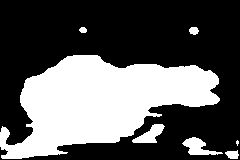
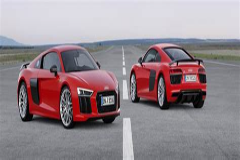
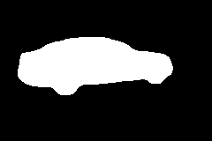
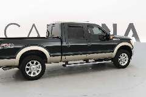

## Notes

The model was trained on `Carvana` dataset. A checkpoint is saved per epoch as well as some predicted, its corresponding real image masks. These are saved in `saved_images` folder. 

Using `3 epochs` and `IMAGE_HEIGHT = 160, IMAGE_WIDTH = 240` it was enough to get decent result on the dataset. Validaiton input images and masks were created by taking first `300` images from both train image and mask folder. Train model size is `~360mb`.

`Albumentation` must be installed via pip and if there is any error then upgrading numpy may solve it.

## Results

Some results are not good because these were collected from web and these types of images were not in the dataset.

 

 

 

 

## References

- U-NET implementation tutorial, https://www.youtube.com/watch?v=IHq1t7NxS8k&t=22s.
- U-NET code, https://github.com/aladdinpersson/Machine-Learning-Collection/tree/master/ML/Pytorch/image_segmentation/semantic_segmentation_unet.
